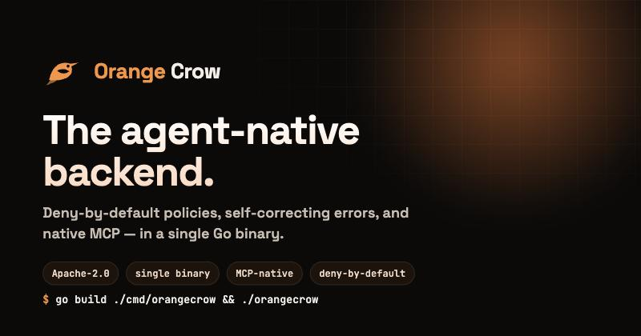

<p align="center">
  
</p>

<h1 align="center">Orange Crow</h1>

<p align="center">
  <strong>The agent-native backend.</strong><br>
  A backend-as-a-service built for AI coding agents — deny-by-default policies,
  self-correcting errors, one-call introspection, and native MCP — in a single Go binary.
</p>

<p align="center">
  <a href="LICENSE"></a>
  
  
  
  
  
  
</p>

<p align="center">
  <a href="https://dibakshya01.github.io/orange-crow/">Website</a> ·
  <a href="https://dibakshya01.github.io/orange-crow/eli5.html">In plain English</a> ·
  <a href="https://dibakshya01.github.io/orange-crow/docs.html">Docs</a> ·
  <a href="https://dibakshya01.github.io/orange-crow/architecture.html">Architecture</a>
</p>

---

## Why

Generic backends were built for humans clicking dashboards. **Coding agents** operate
through APIs — and generic backends fail them in three ways: they fail *silently*,
they leak data through *missing* access rules, and they're *undiscoverable*. Orange
Crow is designed so an agent can drive it correctly and recover on its own.

| | |
|---|---|
| 🛡️ **Secure by default** | Access is deny-by-default. An app-layer policy engine compiles rules into **parameterized** SQL with `USING` *and* `WITH CHECK`. Fuzz-tested; the compiler never emits a raw literal. |
| 🧭 **Self-correcting** | Every error carries machine-readable `remediation` + `next_actions`. When an agent hits a wall, the response tells it how to get past it. |
| 🔎 **Discoverable** | `GET /meta` returns the whole backend's shape in one call. Docs are served over the API. An advisor lints the config. |
| 🪶 **Runs anywhere** | One static binary + embedded SQLite — zero dependencies for a solo dev. Point `OC_DATABASE_URL` at Postgres to scale. Same code, same behavior (CI proves parity). |
| 🔌 **MCP-native** | `orangecrow mcp` exposes the whole backend as tools for Cursor, Claude, and friends. |

## Quick start

```bash
# one static binary, embedded SQLite — no external services
CGO_ENABLED=0 go build -o orangecrow ./cmd/orangecrow
OC_ADMIN_API_KEY=oc_sk_dev ./orangecrow            # → 127.0.0.1:8787

ADMIN="Authorization: Bearer oc_sk_dev"

# create a table (id + created_at are automatic)
curl -s -H "$ADMIN" -X POST localhost:8787/v1/tables \
  -d '{"name":"todos","columns":[{"name":"title","type":"text"},{"name":"owner_id","type":"text"}]}'

# access is deny-by-default — grant a policy, then use records
curl -s -H "$ADMIN" -X POST localhost:8787/v1/policies \
  -d '{"table":"todos","action":"select","roles":["anon"],"using":"true"}'
curl -s -H "$ADMIN" -X POST localhost:8787/v1/tables/todos/records -d '{"title":"ship","owner_id":"u1"}'
curl -s localhost:8787/v1/tables/todos/records

# introspect · read docs · lint config
curl -s -H "$ADMIN" localhost:8787/meta
curl -s localhost:8787/docs
curl -s -H "$ADMIN" localhost:8787/advisor
```

Connect an agent: `orangecrow mcp-config` prints a client config snippet;
`orangecrow mcp` runs the MCP stdio server.

## What's inside

```
Agents (MCP · CLI · REST)
        │
   HTTP gateway  — request-id · authn · recovery · access-log · security-headers
        │
  Data+Records · Auth · Agent layer(docs/memory/advisor)  · [Storage/Functions/Realtime — planned]
        │
  ┌───────────────── Policy engine (deny-by-default, USING + WITH CHECK) ─────────────────┐
  │                   the authorization boundary — one place to get right                  │
  └───────────────────────────────────────────────────────────────────────────────────────┘
        │
   DataEngine port →  SQLite adapter (solo)   |   Postgres adapter (scale)
```

- **Data + policy** — tables, records CRUD, PostgREST-style filters; every read row-filtered, every write checked.
- **Auth** — email/password, RS256 JWTs via JWKS, single-use refresh rotation, hashed API keys.
- **Agent layer** — docs-over-API, per-subject memory, an advisor for risky config.
- **MCP + CLI** — the whole surface as agent tools; `serve` / `mcp` / `mcp-config` / `version`.

## Status — honest about limits

**Alpha.** Real, tested, and safe to try — not yet production-hardened.

- ✅ Built: M0 foundations · M1 data + policy spine · M2 auth · M3 agent layer · M4 MCP/CLI · M5 Postgres engine.
- 🧪 Quality gates: `go test -race`, `go vet`, `staticcheck`, `govulncheck` — all green. Postgres parity proven in CI.
- 🔬 Reviewed: spec-reviewed per milestone, plus repeated back-to-back adversarial review rounds.
- 🚧 Not built yet: file storage, edge functions, realtime, and the web dashboard (designed, not implemented).
- ⚠️ The policy engine is the crown jewel and warrants an **independent security audit** before you store real/regulated data.

## Development

```bash
make build     # single static binary
make test      # go test -race ./...
make check     # fmt + vet + staticcheck + govulncheck + test (matches CI)
```

## Contributing & security

Spec-driven, deny-by-default, tests required — see [CONTRIBUTING.md](CONTRIBUTING.md).
Report vulnerabilities privately via [SECURITY.md](SECURITY.md), not public issues.

## License

[Apache-2.0](LICENSE). Built in the open. Not affiliated with any other backend platform.
